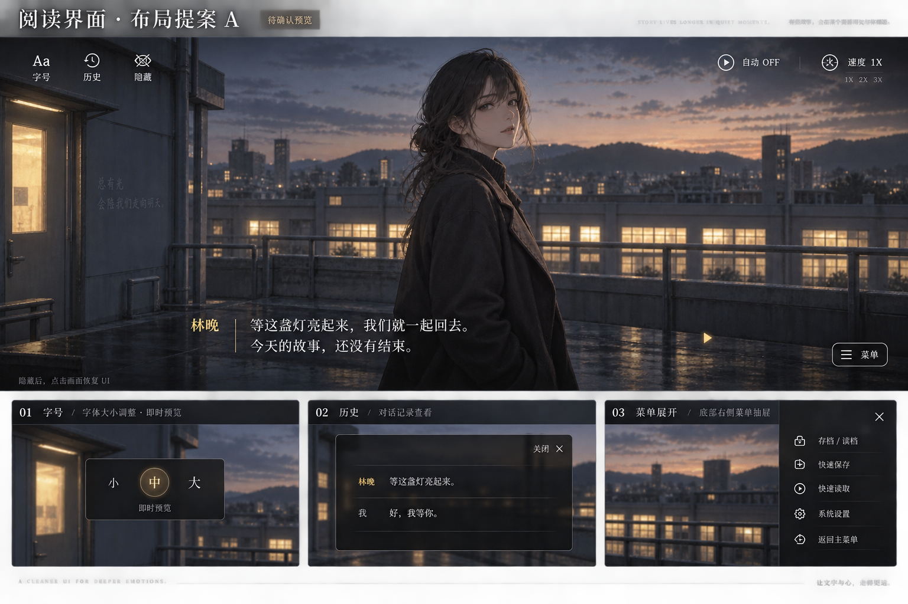
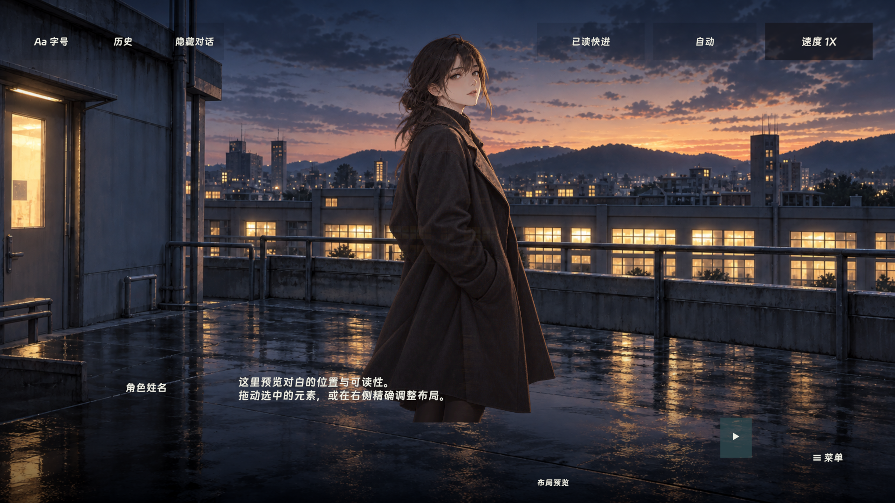
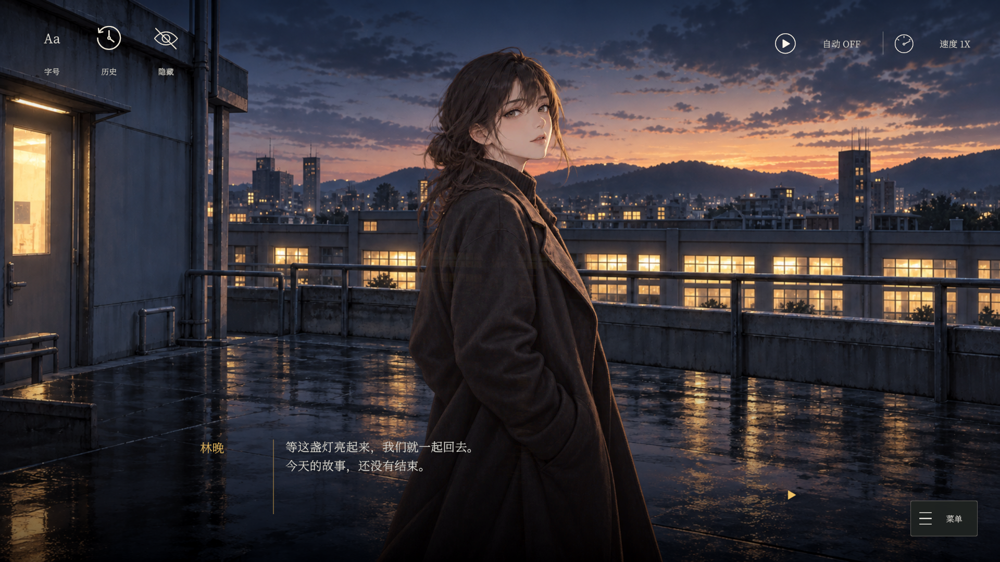
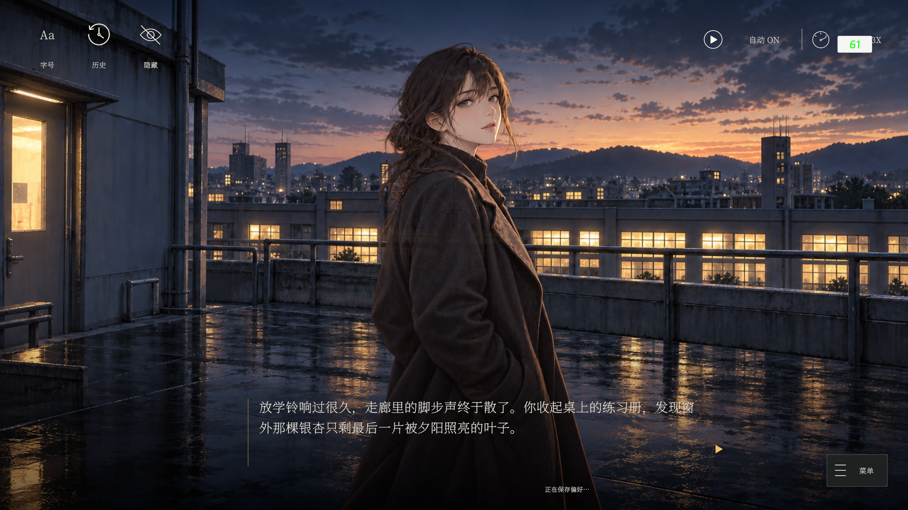
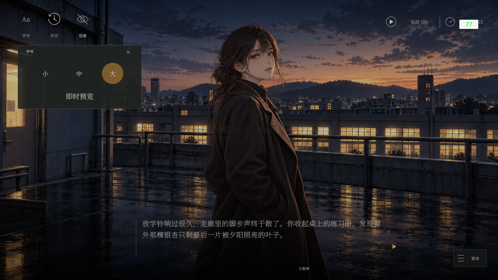
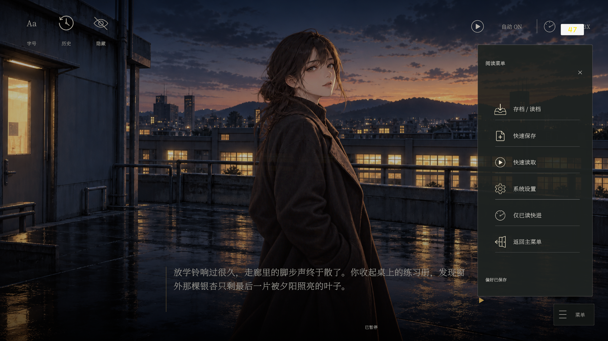

# 阅读界面布局与交互规范

更新：2026-09-21。本文件维护当前正式 UI 规范，文件名保留以兼容已有链接。运行布局对应 0.4.3，文档随 0.4.4 收束；验证与剩余验收见 [实施清单](Implementation.md)。

依据用户提供的四张截图：顶部轻量阅读控制、底部渐变对白、字号浮层与历史覆盖层。截图中的角色、场景与品牌不作为模板资源导入；后续新增独立示例美术与正式接入见下文 2026-09-21 记录。

## 当前正式布局

- 对话底部由黑色托底与向上透明的渐变组成。姓名为灰色，正文为白色；正文右边界留在推进箭头之前，避免长句占用箭头位置。
- `ReadingShading/Advance` 是整个底部渐变区域的点击面；其 `Label` 才是可见箭头。姓名、正文和装饰不拦截 Raycast。点击区域和 Space/Enter 均复用会话推进：先补全文字，再推进；选项仍由对应按钮选择。
- 历史页为暗化舞台上的无边框列表。灰色姓名、白色正文两列，最新记录前有黄色标记；自动换行及显式换行保持正文列对齐。短历史居中，长历史定位最新记录，右侧滚动条可操作；空历史显示提示。
- 历史打开时隐藏底层对白、选项和阅读工具，暂停门控继续阻止推进；保留历史页自身“返回阅读”“存读档”入口。
- 右侧阅读菜单为六项：存档/读档、快速保存、快速读取、系统设置、仅已读快进、返回主菜单。上下留白已压缩；分割线只在相邻项之间，最后一项下方不保留线。底部保留紧凑的操作反馈位置。
- 在 Unity 编辑器中，Game 视图获得焦点后才接收 Space；流程图窗口的空格搜索与小说推进不是同一输入上下文。

后面的概念图及早期运行截图为设计来源和历史证据。当前尺寸以正式 Prefab 为准，不应按旧图恢复大块菜单留白或末项分割线。
## 已确认的实例与视觉规范

本图已归入模板文档，作为布局、层次、按钮分组与弹窗风格规范。图中的“待确认预览”是出图时的历史标记；当前状态为用户已批准。人物、背景已按后续要求制作为独立示例素材，供编辑器预览使用；2026-09-21 已另行将资源接入 LastLight 示例，见末节。

## 独立示例素材（2026-09-20）

原图是合成概念图，没有原始分层文件。以下图片参照原图重新生成、补全遮挡部分，并非逐像素提取。背景不含人物、文字或按钮，人物使用真实透明通道；正式按钮、字号弹窗和渐变仍由 EUI 制作。

| 元素 | 图片 | 导入 |
|---|---|---|
| 黄昏天台背景 | [rooftop_dusk.png](../../../GameResource/Resources/UI/Module/Narrative/Atlas/LastLight/Backgrounds/rooftop_dusk.png) | 1672 × 941，Sprite Single |
| 林晚立绘 | [lin_evening.png](../../../GameResource/Resources/UI/Module/Narrative/Atlas/LastLight/Portraits/lin_evening.png) | 1024 × 1536，透明 PNG，Sprite Single |

打开 **Ember / 视觉小说 / Gameplay 主UI布局**，在预览图片区域点击 **使用规范示例：黄昏天台 / 林晚**，将背景和中间立绘设为上述素材，清空左右预览立绘。新窗口默认使用这一组素材。流程图节点预览可使用这组图片作为初始上下文；当前节点自身的背景/立绘命令仍按原规则覆盖，不推断前序分支。

该操作只改变编辑器静态预览，不保存到 Prefab、故事 SO 或资源表。需要在正式剧情中使用时，应通过现有资源配表和烘焙流程配置，再由 SO 的演出命令引用；不直接修改生成 bytes。

上图为 Unity 实际静态预览输出，采用无刘海安全区。独立预览副本禁用屏幕坐标驱动的 EUISafeArea 并拉伸填满父级，避免读取当前 Game View 坐标造成偏移；正式 Prefab 与运行时组件不受影响。静态文字/按钮状态用于编辑定位，运行时开关和菜单可见性由 EUI 逻辑控制。本图不作为异形屏适配或实际剧情运行验收。

## EUI 制作约束

用户明确要求：**项目的所有正式 UI，包括字号调整等弹窗，必须通过 EUI 系统制作。** 新弹窗采用开发中心创建的 EUI Page/Popup，控件采用真实 Prefab 与 Binding；复用项采用 EUI Item，并遵守页面/Item 生命周期、输入遮罩和暂停所有权。不用运行时临时 Canvas、OnGUI 或绕过 EUI 管理的弹窗。现有历史、存档、设置页面继续复用 EUI。此要求不涉及 Unity 自身的 EditorWindow 工具。

新增或修改 EUI 时，必须在 EUIBinding 的“UI 用途”字段填写简明中文说明，说明页面/控件用途及主要操作；Page 与 Item 均适用。不要只在 C# 注释或文档中说明而遗漏 Inspector 字段。

## 布局

| 区域 | 控件 | 当前交互 |
|---|---|---|
| 左上，从左到右 | 字号、历史、隐藏 | 严格保留三个入口；第二项“显示”已确认为对话历史 |
| 右上 | 自动 OFF/ON、速度 1X/2X/3X | 自动独立开关；点击速度循环切换，常显当前倍率 |
| 底部 | 角色名、正文、推进提示 | 黑色托底与透明渐变，无厚重对白框；正文换行并避开箭头。自动分页尚未实现，不作为已交付能力 |
| 右下 | 菜单 | 点击展开竖向操作面板，平时收起 |
| 菜单内 | 存档/读档、快速保存、快速读取、系统设置、仅已读快进、返回主菜单 | 复用现有功能；返回主菜单放末尾，与存档操作分隔 |

概念图菜单缩略卡展示五个主要管理项；正式实施须额外保留“仅已读快进”一项，不能因新倍率入口删除既有能力。操作成功/失败提示显示在菜单附近，不常驻占据顶部。选择按钮沿用剧情分支功能，置于画面中下部，对话、选项和菜单不得互相覆盖。

## 交互语义（已确认）

- 字号按截图提供小/中/大，调整正文与历史正文的显示大小，不是更换字体文件，也不改变文字播放速度。选中即预览，记忆偏好；默认中号。正式数值结合现有 Canvas 与字体实测，不能直接覆盖用户整体字体设计。
- 历史覆盖层压暗舞台，显示已完整显示的对白，支持滚动与关闭。沿用只读历史，不回滚，不重新触发剧情。
- 隐藏按钮隐藏对白、选项及所有操作按钮，保留背景/立绘；添加独立点击恢复区域。隐藏时暂停小说推进与会话配音，恢复后只解除自身暂停原因。点击画面一次恢复 UI，消费这次输入，不补全文字、不跳句、不选中底下选项。退出/读档时清理恢复拦截状态。
- 字号、历史、菜单等操作面板打开时暂停阅读；关闭只解除各自的暂停原因，遵守嵌套暂停。操作面板互斥显示。
- **倍率建议只调整文字显示速度与自动等待间隔**：有效文字速度为用户基础速度乘倍率，自动等待间隔除以倍率；不写回覆盖用户基础参数。自动模式仍须等文字和 Voice 完成，配音保持正常语速、音高，不截断配音。因此有配音时不保证整句耗时严格减半或变为三分之一。
- 倍率不是全局 Time.timeScale，不加速 BGM/SFX、转场、Loading 或存档。自动 OFF 时倍率只影响逐字显示，不自行推进。倍率可记忆，自动开关不默认继承为开启。
- 既有“仅已读快进”保持停在未读句与选择，进入时与自动模式互斥，不受新倍率重新定义；从菜单进入后可以通过顶部状态退出。具体状态文案在实现前补齐，不用倍率按钮暗示可以跳过未读剧情。

若用户希望 2X/3X 同时加速配音或等同于跳过剧情，需要单独确认其语义与音频支持后更新本提案，不能擅自变更已确认的 M4 约束。

## SafeArea 与实现边界

正文、阅读工具、浮层与菜单布局在既有 SafeArea 下，背景/立绘与渐变遮罩全屏；推进命中区与箭头属于 ReadingShading，移动端安全区仍需单独验收。相对安全区定位，额外留出边缘间距；手机触摸区域至少按目标设备验证 44–48 逻辑像素。超宽屏保持对白最大阅读宽度，窄屏调整间距和换行，大字号不能挤掉菜单或选项。

正式改动使用 ember-eui-build 与开发中心：读取实际 Prefab/Binding，保留控件引用与用户美术，必要时增补绑定后生成，再接用户逻辑。复用存档页、设置页、历史页和现有会话服务。Gameplay 布局工具仍只管理阅读主 UI，不扩展启动菜单。不要恢复已删除的 M1–M4 一次性制作工具。

## 批准后的执行与验收

1. 布局、历史按钮与倍率语义已获用户确认，按本版修改正式资源与代码。
2. 调整主阅读页布局与三个左上入口、自动/倍率、折叠菜单；复用原存读档入口，补齐字号偏好。
3. 检查隐藏/恢复输入不穿透、嵌套暂停、长句与大字号、空 Voice/有 Voice、倍率切换、选项、存读档及退出的状态清理。
4. Unity MCP 编译及相关回归；真实画面、SafeArea 与不同分辨率人工确认。概念图不作为已实现或已适配证据。
5. 同步文档后通过模板系统保存/Bump。当前快照已封存；消费项目部署和框架发布仍是独立步骤，本轮未执行。

## 正式资源与实测截图（2026-09-21）

阅读页、字号弹窗、历史、菜单均为正式 EUI；8 张图标统一位于 Resources/UI/Common/Atlas/Novel：history、hide、auto、speed、save、quick_save、settings、return。菜单依次使用 save、quick_save、auto、settings、speed、return；字号 Aa 和菜单三横线仍由 TMP/uGUI 绘制。所有装饰图片关闭 Raycast，不新增交互绑定。弹窗风格、按钮位置与字体已写入正式 Prefab，因此布局编辑器与实际游戏共同使用。

中文字体为 Noto Serif SC，来源 https://github.com/google/fonts/tree/main/ofl/notoserifsc ，字体文件和 SIL OFL 1.1 许可证位于 Resources/UI/Common/Fonts/NotoSerifSC，动态 TMP 资源为 NovelSerif SDF.asset。

示例新增配表键 lastlight_rooftop、lastlight_alice，由现有配表流程烘焙；CH01_intro/common 以中心单立绘呈现。既有台词/角色 ID 保留；该段为早期接入记录；当前 LastLight 剧本与角色命名见 [示例说明](SampleWalkthrough.md)。

实际截图来自 2026-09-21 三项通过的 Gameplay 回归；截图保留调试 FPS 浮层，遮住部分倍率文字。静态预览使用规范示例文本，实际运行使用剧情正文和实时状态，两者不要求文字相同。本批不是逐像素复刻，也不代替异形屏、长句、大字号与用户人工视觉验收。

### 图标生成记录

工具：内置 image_gen.imagegen。输入为文字提示，输出真实透明 PNG。没有对图片做程序化裁剪/重绘；Unity 以 Sprite Single、最大 256、关闭 mipmap、无压缩导入。

前四张共用提示：Create one production-ready Unity UI icon PNG on a true transparent alpha background. Minimal elegant thin ivory-white monoline, flat 2D, no gradients, no lettering, no box, no shadows, no extra symbols, square canvas. Icon occupies central 75% of canvas with ample transparent padding; consistent clear 12px stroke at 512px, round line caps, readable at 32px. This is for the subtle cinematic visual novel UI in the reference; output ONLY the icon, not a screen/mockup.

分别描述：history 为逆时针箭头时钟；hide 为斜杠眼睛；auto 为圆形播放键；speed 为三刻度速度表。

后四张共用提示：One production Unity game UI icon on true transparent alpha background. Square canvas, centered symbol fills 70%, pure warm ivory flat strokes, minimal 2D outlined thin monoline, clean smooth antialiasing, no texture, no glow, no shadows, no gradient, no text, no background. Keep interior and surrounding pixels fully transparent. Elegant restrained visual novel menu icon, legible at 28 pixels.

分别描述：save 为托盘向下箭头；quick_save 为文档加号；settings 为六齿齿轮；return 为向左箭头退出门。

### 分支选项底框（2026-09-22）

每个选项文字下方使用独立的半透明深色底框（55% 不透明度），选项之间保留间距；背景覆盖整条点击区域，不能只剩文字或合并为一个大底板。正式阅读页 ChoiceTemplate 的完全透明背景覆盖由 `NovelChoiceBackgroundMigration` 经 EUI 中心校验后修复；本次 Unity 执行及画面复验待完成，详见 Implementation 的本次记录。

## E4 文字模式与分页增量（2026-09-22，测试获用户确认通过）

普通对白保留既有布局；标题和全屏旁白临时复用 Dialogue/Body/Speaker，将文字区扩展至安全区内，隐藏姓名及其分隔线并使用暗色底板。下一句普通对白或 ClearVisuals 还原缓存布局与底板。没有新增 Prefab/Binding，未改变 EUI 中心归属。

TMP 按当前字号和区域分页，正文保持纯文本。页内先补全、再翻页，末页再推进下一句；中间页不成为存档或历史稳定点。原底部推进面与箭头、顶部阅读控制继续保留，文字不接收 Raycast。多字号、16:9/4:3 和极长文仍需本批 Unity 验收，不能沿用旧版布局截图作为新模式证据。

## E5 舞台变换边界

E5 已接入舞台镜头与背景擦除，本批已获用户确认全部通过、文档已收束。镜头只修改背景、人物和粒子实例的变换；对白、姓名、选项、工具菜单和 E4 文字模式布局不参与。所有原始锚点、位置和缩放在停止/清理时复位。擦除使用现有双图 Item 的 Image Filled，结束恢复原样式，不新增正式 Prefab 或 Binding。

默认铺满视口的背景按镜头平移范围保持覆盖；自定义背景留白/透明边与舞台震动额外余量应在各画幅验收。本批包含 1920×1080 与 1440×1080 测试定义，后续用户已确认“全部通过”；未单独提供逐画幅渲染证据，不扩大为全平台画面验收。字段说明见 [配置手册](EffectConfiguration.md#9-e5镜头擦除与演出预设)。

