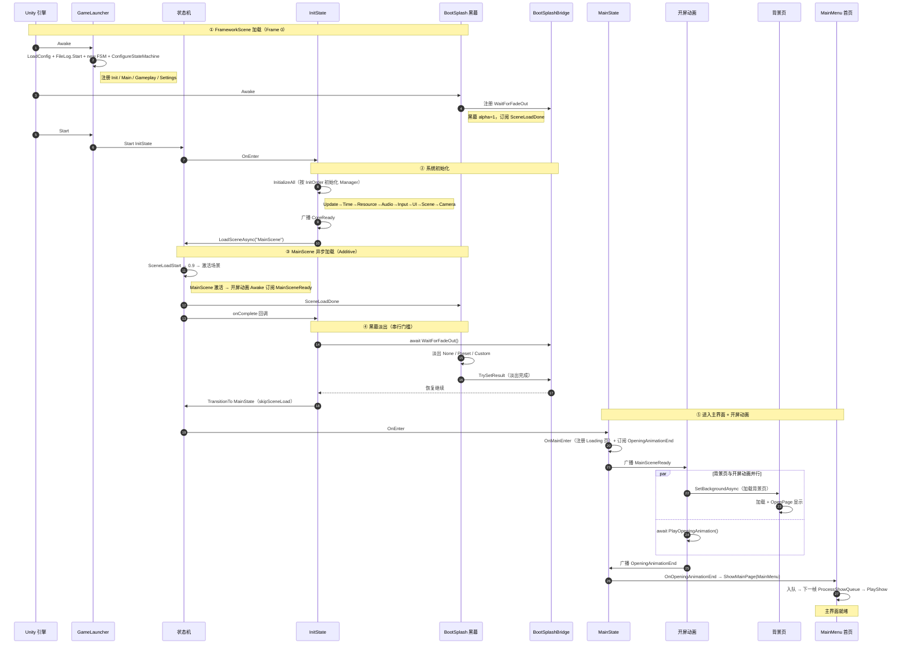

# 启动流程（Boot Sequence）

本文档梳理「进入游戏后」从 Unity 加载 FrameworkScene 到主界面首页（MainMenu）就绪的完整启动时序。

**什么时候读：** 需要理解框架如何编排启动、要在启动链上挂业务逻辑（自定义黑幕、开屏动画、MainState、页面注册）、或排查启动阶段的黑幕/背景/首页抢跑穿帮时。

---

## 一、架构概览

启动链由三层协作完成，控制权依次流经：

```
GameLauncher（框架入口）
   │ Awake/Start
   ▼
状态机 FSM ── Start<InitState>
   │
   ▼
InitState ── 初始化 Manager → 加载 MainScene → 等黑幕淡出 → TransitionTo<MainState>
   │
   ▼
MainState ── 广播 MainSceneReady → 开屏动画(背景页∥动画) → 广播 OpeningAnimationEnd
   │
   ▼
GameMainState.OnOpeningAnimationEnd ── ShowMainPage(MainMenu)
```

全程五个阶段、两道串行门槛：

| 阶段 | 干什么 | 关键系统 |
|------|--------|---------|
| ① FrameworkScene 加载 | 启动器 + 黑幕就位 | GameLauncher / BootSplash |
| ② 系统初始化 | 反射扫描并按 InitOrder 初始化所有 Manager | EmberManagerCollector |
| ③ MainScene 加载 | 异步 Additive 加载主场景 | EmberSceneManager |
| ④ 黑幕淡出 | 黑幕完全消失才切换状态（门槛①） | BootSplash / BootSplashBridge |
| ⑤ 主界面就绪 | 开屏动画 + 背景页并行，就绪后开首页（门槛②） | MainState / 开屏动画 / EUIManager |

---

## 二、时序图



---

## 三、阶段详解

### ① FrameworkScene 加载（Frame 0）

- `GameLauncher.Awake`（`OnBootAwake`）：加载日志配置、启动文件日志、`new EmberStateMachine` + `ConfigureStateMachine` 注册 Init / Main / Gameplay / Settings 四状态。
- `EUIBootSplash.Awake`：黑幕 alpha 置 1 遮挡画面、向 `EmberBootSplashBridge` 注册 `WaitForFadeOut` 委托、订阅 `SceneLoadDone`。
- `GameLauncher.Start`（`OnBootStart`）：`Fsm.Start<InitState>()` 进入初始状态。

### ② 系统初始化（InitState.OnEnter）

`EmberManagerCollector.InitializeAll()` 反射扫描所有 `IEmberManager` 实现，按 `EmberInitOrder` 升序初始化：

| InitOrder | Manager |
|-----------|---------|
| Core(100) | EmberUpdateManager |
| Time(105) | EmberTimeManager |
| Resource(200) | EmberResourceManager |
| Audio(300) | EmberAudioManager |
| Input(400) | EmberInputManager |
| UI(500) | EUIViewEngine |
| UI+1(501) | EUIManager |
| Scene(600) | SceneCoordinator / EmberSceneManager |
| Default(1000) | EmberCameraManager |

其中两处对启动链至关重要：

- `SceneCoordinator.Init` 注入 `Fsm.OnSceneTransition` 与 `Fsm.LoadSceneAsync` 委托。
- `EUIManager.Init` 注册 `SceneCoordinator.InterceptSceneLoad`（跨场景 Loading 拦截），并广播 `UIManagerReady`。

完成后广播 `CoreReady`，再调用 `LoadSceneAsync("MainScene")`。

### ③ MainScene 异步加载

`InitState` 通过 `Fsm.LoadSceneAsync` 委托（由 SceneCoordinator 注入）走到 `EmberSceneManager.LoadSceneAsync`：Additive 加载、`allowSceneActivation = false` 停到 0.9、激活场景、广播 `SceneLoaded` + `SceneLoadDone`、最后回调 `onComplete`。

MainScene 激活时，场景内的 `EUIMainAnimationStarter.Awake` 执行并订阅 `MainSceneReady`（早于广播，无竞态）。

### ④ 黑幕淡出（门槛①）

`SceneLoadDone` 触发 `EUIBootSplash.OnFirstLoadDone`，按 `BootSplashFadeMode` 淡出（None / Preset / Custom），`finally` 里 `TrySetResult` 唤醒桥接。`InitState` 的回调 `await WaitForFadeOut()`，黑幕完全消失后才 `TransitionTo<MainState>(skipSceneLoad: true)`。

### ⑤ 主界面就绪（门槛②）

`MainState.OnEnter` 依次：广播 `SceneLoaded` → `OnMainEnter`（`GameMainState` 在此注册 Loading 页）→ 订阅 `OpeningAnimationEnd` → 广播 `MainSceneReady`。`EUIMainAnimationStarter` 收到后并行执行「背景页加载」与「开屏动画」，两者都完成才广播 `OpeningAnimationEnd`；`MainState` 收到后调用 `OnOpeningAnimationEnd`，`GameMainState` 最终 `ShowMainPage(MainMenu)`。

---

## 四、两个串行门槛

### 门槛① 黑幕淡出（BootSplashBridge）

`InitState` 在 TransitionTo 前 `await EmberBootSplashBridge.WaitForFadeOut()`。黑幕淡出完成后才放行，保证开屏动画与首页在黑幕完全消失之后才开始。

> 若业务层未挂 BootSplash（`WaitForFadeOut == null`），跳过等待立即 TransitionTo。

### 门槛② 背景页就绪（SetBackgroundAsync）

`EUIMainAnimationStarter` 并行执行「背景页加载」与「开屏动画」，两者都完成才广播 `OpeningAnimationEnd`，保证首页打开时兜底背景已就位，不抢跑穿帮。

---

## 五、业务层挂载点

启动链上为业务层预留了五个扩展点，改业务只动子类、不碰框架：

| 扩展点 | 方式 |
|--------|------|
| 黑幕 | 继承 `EUIBootSplash`，`override OnCustomFadeOut`（Custom 模式）或切换 `BootSplashFadeMode` |
| 开屏动画 | 继承 `EUIMainAnimationStarter`，`override PlayOpeningAnimation` 返回动画 `UniTask` |
| MainState | 继承 `MainState` 为 `GameMainState`，override `OnMainEnter` / `OnMainExit` / `OnOpeningAnimationEnd` |
| 页面注册 | 在 `GamePages` 静态类里声明 `EUIPageDef` |
| 状态注册 | 继承 `GameLauncher` 的 `ConfigureStateMachine` 追加业务状态 |

---

## 六、文件地图

| 文件 | 命名空间 | 内容 |
|------|---------|------|
| `Assets/Ember/Core/Runtime/GameLauncher.cs` | `Ember.Core` | 启动入口，创建状态机、驱动 Update、销毁 |
| `Assets/Ember/Core/Runtime/State/EmberStateMachine.cs` | `Ember.Core` | 状态机：Start / TransitionTo / Push / Pop |
| `Assets/Ember/Core/Runtime/State/InitState.cs` | `Ember.Core` | 初始化状态：Manager 初始化 + 加载 MainScene + 等黑幕 |
| `Assets/Ember/Core/Runtime/State/MainState.cs` | `Ember.Core` | 主界面状态：开屏动画事件链 |
| `Assets/Ember/Core/Runtime/Manager/EmberManagerCollector.cs` | `Ember.Core` | 反射扫描并初始化所有 Manager |
| `Assets/Ember/Core/Runtime/Manager/EmberInitOrderAttribute.cs` | `Ember.Core` | 初始化顺序常量 |
| `Assets/Ember/Core/Runtime/EmberBootSplashBridge.cs` | `Ember.Core` | 黑幕淡出等待桥接 |
| `Assets/Ember/Core/Runtime/Event/EmberBroadcastEvent.cs` | `Ember.Core` | 广播事件常量表 |
| `Assets/Ember/Scene/Runtime/SceneCoordinator.cs` | `Ember.Scene` | 状态机 ↔ 场景管理器桥接 |
| `Assets/Ember/Scene/Runtime/EmberSceneManager.cs` | `Ember.Scene` | 场景异步加载/卸载 |
| `Assets/Ember/UI/Runtime/EUIManager.cs` | `Ember.UI` | UI 应用层入口：ShowMainPage / SetBackgroundAsync |
| `Assets/Ember/UI/Runtime/EUIViewEngine.cs` | `Ember.UI` | UI 视图引擎（底层） |
| `Assets/Game/State/GameMainState.cs` | `Game.State` | 业务 MainState |
| `Assets/Game/UI/EUIBootSplash.cs` | `Game.UI` | 黑幕（实现 `IEUIPersistentUI`） |
| `Assets/Game/UI/EUIMainAnimationStarter.cs` | `Game.UI` | 开屏动画基类 |
| `Assets/Game/UI/EUIDefaultMainAnimation.cs` | `Game.UI` | 默认开屏动画（立即完成） |
| `Assets/Game/UI/GamePages.cs` + `GamePages.User.cs` | `Game.UI` | 页面注册表（框架区/用户区，partial 拼接） |

---

## 七、关键细节与坑

1. **BootSplash 必须实现 `IEUIPersistentUI`**：否则 `EUIViewEngine` 初始化时会把它当普通 UI 隐藏掉，黑幕就遮不住了。

2. **`SceneLoadDone` 先于 `onComplete` 回调广播**（`EmberSceneManager.LoadAsync` 末尾顺序），所以黑幕先开始淡出、`InitState` 才 `await`。依赖这个顺序，别改成回调先于事件。

3. **`TransitionTo` 用 `skipSceneLoad: true`**：MainScene 已由 InitState 预加载，切状态时不重复加载场景。

4. **开屏动画组件在 MainScene 里**：它的 `Awake` 在场景激活时执行（早于 `SceneLoadDone`），因此 `MainSceneReady` 的订阅一定早于广播，无竞态。

5. **背景页走 `SetBackgroundAsync`、不走 ShowQueue**：`sortingOrder` 固定 0、单槽位，与首页不同通道，避免排队阻塞。

6. **`ShowMainPage` 是入队而非即时打开**：`MainMenu` 在下一帧 `ProcessShowQueue` 才真正加载并 `PlayShow`。

7. **未挂 BootSplash 也能跑**：`WaitForFadeOut == null` 时 InitState 跳过等待直接切换，启动链自动退化为「无黑幕」路径。
